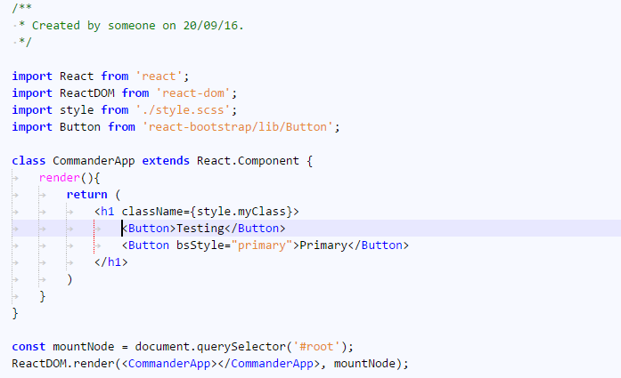

# NotepadPlusPlus Remixed Theme
This is a theme intended for use with Visual Studio Code, created using [TmTheme-Editor](http://tmtheme-editor.herokuapp.com) and some manual tweaking.

It is not an exact replica of the Notepad++ default theme. JS/HTML/Python colors were used as a base but were partly combined and modified a bit.

For the guides, I recommend the extension [spywhere.guides](https://marketplace.visualstudio.com/items?itemName=spywhere.guides).

